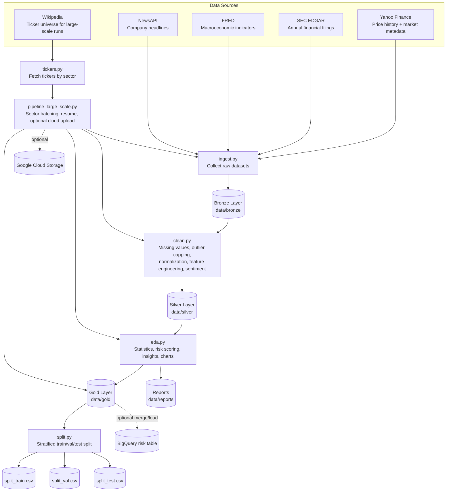

# Data Pipeline Diagram

```mermaid
flowchart TD
    subgraph Sources[Data Sources]
        YF[Yahoo Finance\nPrice history + market metadata]
        SEC[SEC EDGAR\nAnnual financial filings]
        FRED[FRED\nMacroeconomic indicators]
        NEWS[NewsAPI\nCompany headlines]
        WIKI[Wikipedia\nTicker universe for large-scale runs]
    end

    INGEST[ingest.py\nCollect raw datasets]
    TICKERS[tickers.py\nFetch tickers by sector]
    BRONZE[(Bronze Layer\ndata/bronze)]

    CLEAN[clean.py\nMissing values, outlier capping,\nnormalization, feature engineering, sentiment]
    SILVER[(Silver Layer\ndata/silver)]

    EDA[eda.py\nStatistics, risk scoring, insights, charts]
    GOLD[(Gold Layer\ndata/gold)]
    REPORTS[(Reports\ndata/reports)]

    SPLIT[split.py\nStratified train/val/test split]
    TRAIN[(split_train.csv)]
    VAL[(split_val.csv)]
    TEST[(split_test.csv)]

    ORCH[pipeline_large_scale.py\nSector batching, resume, optional cloud upload]
    GCS[(Google Cloud Storage)]
    BQ[(BigQuery risk table)]

    YF --> INGEST
    SEC --> INGEST
    FRED --> INGEST
    NEWS --> INGEST
    WIKI --> TICKERS --> ORCH

    INGEST --> BRONZE
    BRONZE --> CLEAN --> SILVER
    SILVER --> EDA
    EDA --> GOLD
    EDA --> REPORTS
    GOLD --> SPLIT
    SPLIT --> TRAIN
    SPLIT --> VAL
    SPLIT --> TEST

    ORCH --> INGEST
    ORCH --> CLEAN
    ORCH --> EDA
    ORCH --> GOLD
    ORCH -. optional .-> GCS
    GOLD -. optional merge/load .-> BQ
```